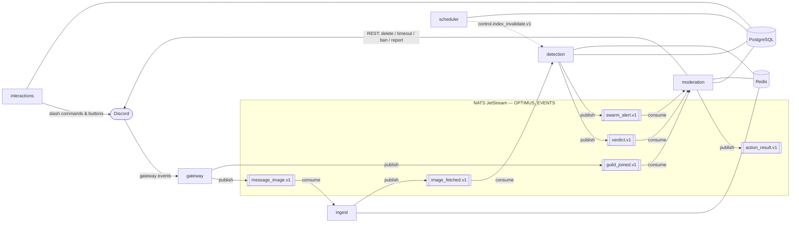
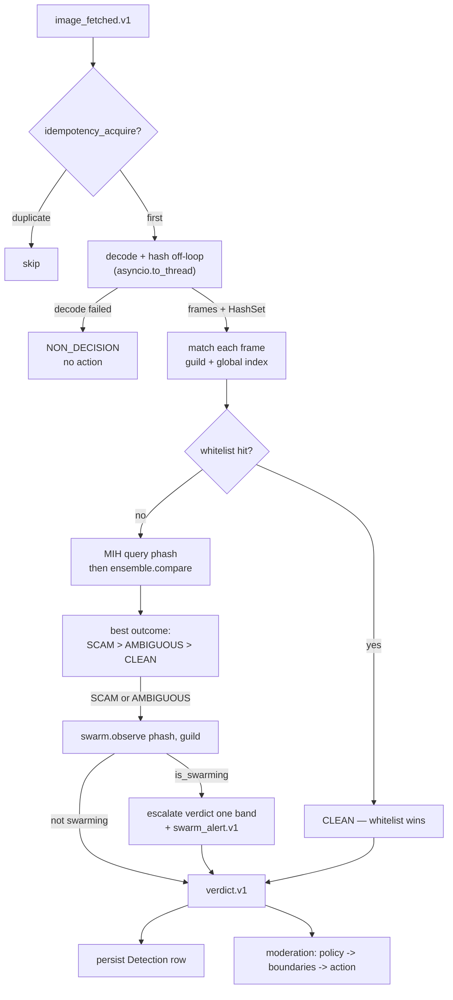
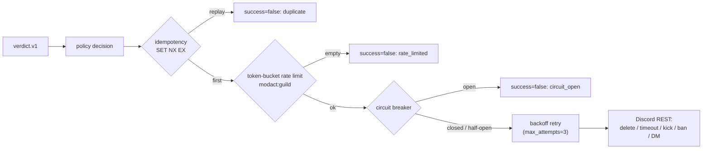

# Architecture

This document describes how optimus is put together: the six services, how a
message becomes a moderation action, where state lives, and where the
resilience controls (circuit breaker, rate limiting, safe mode) sit. It is a
deeper companion to the "How it works" section of the [README](../README.md).
Every claim here is grounded in the source under
[`src/optimus`](../src/optimus); file references point at the authoritative code.

## Design shape

optimus is a set of small, single-purpose **services** that communicate only
over a versioned [NATS](https://nats.io) **event bus** — they share no in-process
state. Each service is an independent process (`python -m optimus.services.<name>`)
and can be scaled or restarted on its own. Persistent state lives in **PostgreSQL**
(durable records) and **Redis** (fast, TTL'd, mostly ephemeral state); the bus
carries the rest.

Three properties hold throughout:

- **Versioned contracts.** Every event is a Pydantic model on a versioned subject
  (`events.<name>.v1`) defined in
  [`contracts/events.py`](../src/optimus/contracts/events.py); the bus validates
  on the way in and on the way out, so a malformed message is a dropped "poison"
  message, never a crash.
- **Fail-closed safety.** Anything the pipeline cannot do safely becomes a
  non-decision: an image that won't decode under sandbox limits yields no verdict;
  a forged interaction is rejected; an unverifiable signed hash is discarded.
- **At-least-once + idempotency.** JetStream redelivers on handler failure, and
  per-attachment idempotency keys (in Redis) make re-processing and re-acting safe.

## Services and the event bus

### The bus

[`bus/nats.py`](../src/optimus/bus/nats.py) wraps a NATS **JetStream** context as
`EventBus`. `publish()` serializes a Pydantic event to JSON and publishes it;
`consume()` runs a durable **pull consumer** with explicit ack semantics:

- handler succeeds → `ack`
- handler raises → `nak` (redelivered, up to `max_deliver=5`)
- payload fails Pydantic validation → `term` (dropped as poison, counted)

All `events.*` subjects are bound to a single bounded stream, `OPTIMUS_EVENTS`
(`RetentionPolicy.LIMITS`, `DiscardPolicy.OLD`, capped at 1,000,000 messages /
1 GiB), so back-pressure discards oldest rather than growing without bound, and
the discard is observable via the `optimus_bus_messages_dropped_total` metric.

One control-plane subject, `control.index_invalidate.v1`, is deliberately **not**
part of the stream: the scheduler publishes it and detection workers receive it
over **core NATS** (`nc.subscribe`) as a fire-and-forget fan-out signal to reload
hash indexes — it is a cache-invalidation hint, not a durable event.

### The six services

| Service | Entrypoint | Consumes | Publishes | Stores / deps |
| --- | --- | --- | --- | --- |
| **gateway** | `optimus.services.gateway` | Discord gateway | `message_image.v1`, `guild_joined.v1` | Discord, NATS |
| **ingest** | `optimus.services.ingest` | `message_image.v1` (durable `ingest`) | `image_fetched.v1` | Redis (fetch rate limit; in-memory fallback), NATS |
| **detection** | `optimus.services.detection` | `image_fetched.v1` (durable `detection`) + `control.index_invalidate.v1` (core NATS) | `verdict.v1`, `swarm_alert.v1` | Postgres (hash indexes, detections), Redis (idempotency, swarm window), NATS |
| **moderation** | `optimus.services.moderation` | `verdict.v1` (durable `moderation`), `swarm_alert.v1` (`moderation-swarm`), `guild_joined.v1` (`moderation-join`) | `action_result.v1` | Postgres (config, audit), Redis (rate limit, cooldown, idempotency, safe-mode), Discord REST, NATS |
| **interactions** | `optimus.services.interactions` | Discord interactions (slash/buttons) | — | Postgres, Discord |
| **scheduler** | `optimus.services.scheduler` | timers | `control.index_invalidate.v1` | Postgres, Redis, NATS |

- **gateway** ([`services/gateway/`](../src/optimus/services/gateway/)) connects
  to Discord, and via [`extract.py`](../src/optimus/services/gateway/extract.py)
  pulls image attachments and `http(s)` URLs / embed images out of each message,
  emitting one `message_image.v1` per candidate. It also emits `guild_joined.v1`
  for one-time provisioning. It is the only Discord gateway connection and the
  one component whose load tracks guild count; it supports
  [gateway sharding](sharding.md) (one process per shard subset) for fleets past
  Discord's single-connection guild ceiling.
- **ingest** ([`services/ingest/`](../src/optimus/services/ingest/)) fetches each
  candidate through the SSRF-hardened fetcher (below), enforces a per-guild fetch
  rate limit, and emits `image_fetched.v1` with the validated bytes inline as
  base64 (streams are size-bounded, so the inline payload is safe and keeps
  workers off disk).
- **detection** ([`services/detection/`](../src/optimus/services/detection/)) runs
  the detection pipeline and emits a `verdict.v1` (and, on cross-guild
  correlation, a `swarm_alert.v1`).
- **moderation** ([`services/moderation/`](../src/optimus/services/moderation/))
  turns a verdict + guild policy into an action, enforcing all the
  Discord-facing resilience controls.
- **interactions** ([`services/interactions/`](../src/optimus/services/interactions/))
  serves slash commands and review buttons with server-side permission re-checks;
  it does not consume bus events.
- **scheduler** ([`services/scheduler/`](../src/optimus/services/scheduler/)) runs
  periodic jobs on jittered intervals — retention enforcement, evidence GC, stats
  rollups, a DB health sweep, and index-rebuild signals.

Each service runs an aiohttp [`HealthServer`](../src/optimus/core/health.py) on
`OPTIMUS_HEALTH_PORT` exposing `/healthz` (liveness), `/readyz` (readiness — runs
registered async checks against the service's NATS, Redis, and (for the
DB-centric interactions service) Postgres dependencies and returns 503 while any
is unreachable; each check is bounded by a per-check timeout so a black-holed
dependency fails closed rather than hanging the probe, see
[`core/readiness.py`](../src/optimus/core/readiness.py)), and `/metrics`
(Prometheus).

## The detection pipeline

A single image flows fetch → decode (sandboxed) → perceptual hashing → match
(MIH + ensemble) → swarm correlation → verdict → policy → action.

### Decode sandbox

[`hashing/decoder.py`](../src/optimus/hashing/decoder.py) decodes untrusted bytes
in a **subprocess** (`[sys.executable, "-c", <inline source>]`, no shell) under
`RLIMIT_CPU`, `RLIMIT_AS` (memory), `RLIMIT_FSIZE=0`, a Pillow pixel cap, a frame
cap, and a parent-enforced wall timeout (defaults from `Settings`:
`decode_cpu_seconds=5`, `decode_mem_bytes=512 MiB`, `max_image_pixels=24M`,
`max_frames=8`, `decode_timeout_seconds=5`). The child returns grayscale frames;
**any** failure returns `None`, which the worker turns into a `NON_DECISION` —
the pipeline never acts on an image it could not safely decode.

In [`DetectionWorker`](../src/optimus/services/detection/worker.py) the
decode-plus-hash block is offloaded with `asyncio.to_thread` (`_decode_and_hash`)
so a slow or large image never stalls the detection consumer's event loop, its
NATS heartbeats, or its health responses.

### Perceptual hashing

[`hashing/perceptual.py`](../src/optimus/hashing/perceptual.py) computes a
four-hash ensemble per frame, each reduced to a 64-bit unsigned int:

- **aHash** — 8×8 mean threshold.
- **dHash** — 8×9 horizontal-gradient threshold.
- **pHash** — 32×32 DCT, low-frequency coefficients vs. median.
- **wHash** — 32×32 Haar wavelet approximation vs. median.

The four hashes are robust to *different* transforms (crop, recolor, recompress,
resize, watermark), which is why the ensemble combines them rather than relying on
any single hash.

### Matching: multi-index hashing + ensemble

Candidate lookup uses **multi-index hashing** (MIH) keyed on pHash
([`hashing/mih.py`](../src/optimus/hashing/mih.py)): each 64-bit pHash is split
into four disjoint 16-bit substrings with one exact-match table per substring, so
a radius-18 query probes a small per-substring Hamming ball and verifies the true
distance — exact results, sub-linear at large corpus sizes where a metric tree
degrades toward a linear scan (see [capacity.md](capacity.md) § Experiment 1). The
[`IndexManager`](../src/optimus/services/detection/index.py) lazily builds and
caches one `HashIndex` per guild plus the global promoted-hash index, each rebuilt
from Postgres and invalidated on the `index_invalidate` signal. The per-guild
cache is an LRU bounded by `detection_guild_index_cap` (default 1024): the
least-recently-used guild index is evicted and rebuilt on demand, so a bot in a
very large fleet cannot hold every index resident at once.

For each pHash candidate, [`ensemble.compare`](../src/optimus/hashing/ensemble.py)
computes a **weighted-average normalized Hamming distance** across all four hashes
(weights pHash 0.40 / dHash 0.30 / wHash 0.20 / aHash 0.10) and classifies it by
the guild's sensitivity preset:

| Preset | `match_threshold` (≤ ⇒ SCAM) | ambiguous band | ambiguous ceiling (≤ ⇒ AMBIGUOUS) |
| --- | --- | --- | --- |
| `strict` | 0.18 | 0.06 | 0.24 |
| `balanced` (default) | 0.12 | 0.05 | 0.17 |
| `permissive` | 0.08 | 0.04 | 0.12 |

Above the ceiling is `CLEAN`. Confidence decays linearly from 1.0 at distance 0 to
0 at the ceiling. A **whitelist** match short-circuits to `CLEAN` regardless — the
zero-false-positive bias that keeps auto-moderation from punishing legitimate
users. An optional ONNX **embedding** confirmation
([`hashing/embedding.py`](../src/optimus/hashing/embedding.py)) exists for
ambiguous matches but is off by default.

### Cross-guild swarms

When a frame is `SCAM`/`AMBIGUOUS`, the
[`SwarmCorrelator`](../src/optimus/services/detection/swarm.py) records the pHash
against the guild in a Redis sorted-set window (atomic Lua: trim by timestamp, add
guild, count distinct guilds; window `swarm_window_seconds=300`,
`swarm_min_guilds=3`). If the same image is hitting enough distinct guilds at
once, the verdict is **escalated one band** and a `swarm_alert.v1` is emitted —
this is how a coordinated campaign across many servers gets caught faster than any
single guild would.

## From verdict to action (moderation)

[`ModerationCoordinator.handle_verdict`](../src/optimus/services/moderation/coordinator.py)
runs a fixed sequence: **config → policy → boundaries → execute → audit → report.**

1. **Policy** ([`policy.py`](../src/optimus/services/moderation/policy.py)) is a
   pure function of (verdict, confidence, guild config). Two thresholds gate it:
   below `mod_queue_threshold` → `NONE`; at/above it but not clearing
   `auto_act_threshold` (or merely `AMBIGUOUS`) → `MOD_QUEUE` (report only);
   `SCAM` clearing `auto_act_threshold` → `AUTO_ACT` with the guild's configured
   action. If **safe mode** is on, an otherwise-auto action is downgraded to
   report-only.
2. **Boundaries** ([`boundaries.py`](../src/optimus/services/moderation/boundaries.py))
   apply only to punitive auto-actions (timeout/kick/ban): if the target left the
   guild, is the owner, has `ADMINISTRATOR`, or sits above the bot in the role
   hierarchy, the action is downgraded to report-only.
3. **Execution** ([`actions.py`](../src/optimus/services/moderation/actions.py))
   applies the action through layered controls (next section).
4. **Audit** persists the detection + action row; **report** posts an embed with
   action buttons to the guild's review channel (if configured).

`ActionExecutor.execute` never raises — rate-limit exhaustion, an open circuit, an
idempotency replay, or a REST error all return `success=False` so an audit row is
always recorded.

## Resilience controls and where they sit

These three controls protect Discord's REST API and the bot's standing in a guild.
They are layered in `ActionExecutor.execute` in this order:

- **Idempotency** ([`core/idempotency.py`](../src/optimus/core/idempotency.py)) —
  a Redis `SET NX EX` on `modact:<idempotency_key>:<action>` makes redelivery
  safe: a replayed verdict cannot double-act.
- **Rate limiting** ([`core/ratelimit.py`](../src/optimus/core/ratelimit.py)) — a
  per-guild **token bucket** (`modact:<guild_id>`, capacity 5 / refill 1/s by
  default) bounds the Discord action rate. The Redis implementation is a single
  atomic Lua script; an `InMemoryRateLimiter` fallback (with `evict_idle` to bound
  its map, driven by a time-gated opportunistic sweep in the ingest fallback) is
  used when Redis is unavailable. Ingest applies the same primitive to per-guild
  fetches.
- **Circuit breaker** ([`core/circuit.py`](../src/optimus/core/circuit.py)) — trips
  open after `mod_circuit_failure_threshold=5` consecutive REST failures, fails
  fast for `mod_circuit_recovery_seconds=30`, then allows a bounded number of
  half-open trial calls (`success_threshold`, reserved synchronously before the
  await so concurrent trials stay capped); successes close it, any failure
  re-opens. State transitions feed a Prometheus gauge for observability.
- **Backoff** ([`core/backoff.py`](../src/optimus/core/backoff.py)) — the guarded
  REST call is wrapped in a jittered exponential retry (`max_attempts=3`) *inside*
  the breaker.

**Safe mode** ([`safemode.py`](../src/optimus/services/moderation/safemode.py))
sits one level up, in policy. A `SafeModeTracker` keeps an EWMA baseline of
per-guild detection volume in Redis (`safemode_alpha=0.3`, `safemode_sigma=4.0`,
`safemode_min_floor=5.0`, TTL 7 days). When a guild's rate spikes past
`baseline + sigma·stdev` (and clears the min floor), the guild flips into safe
mode and the policy engine downgrades every auto-action to report-only — so an
anomalous flood (false-positive storm or a novel attack) degrades to human review
rather than mass automated punishment.

## Data stores: what lives where

### PostgreSQL (durable)

Schema in [`db/models.py`](../src/optimus/db/models.py); access via guild-scoped
repositories in [`db/repositories.py`](../src/optimus/db/repositories.py) (every
query filters by `guild_id`; no raw SQL/`text()` interpolation). Key tables:

- **guilds** — per-guild config: sensitivity, action policy, thresholds, review
  channel, retention, locale, opt-ins, `safe_mode`.
- **guild_hashes** / **guild_whitelist** — per-guild known-scam hashes and
  whitelisted images.
- **global_hashes** / **global_hash_approvals** / **global_submitters** —
  the signed cross-guild promoted-hash database and its approval/reputation
  bookkeeping.
- **detections** — one row per processed image (verdict, distances, action taken,
  unique `idempotency_key`); the audit backbone.
- **appeals**, **mod_actions**, **stats_rollups**, **evidence**, **user opt-out** —
  appeals workflow, moderation audit, periodic rollups, optional evidence
  pointers, and GDPR opt-out state.

Migrations live in [`migrations/`](../migrations): `0001` initial schema, `0002`
PostgreSQL **row-level security** for multi-tenant (`multi`) deployments (policies
keyed on `current_setting('optimus.guild_id')`), `0003` global-submitter
reputation + submitter provenance on global hashes.

### Redis (fast, TTL'd)

Every key is prefixed and built from numeric ids, and **every writer sets a TTL**,
so the keyspace cannot grow without bound:

- token-bucket **rate-limit** state (`optimus:rl:*`),
- **idempotency** keys for detection and moderation actions,
- **swarm** windows (sorted sets, trimmed by timestamp),
- DM/appeal **cooldowns**,
- **safe-mode** EWMA baselines,
- the **guild-config cache** ([`core/guild_config.py`](../src/optimus/core/guild_config.py),
  Redis-cached with DB fallback).

## Trust boundaries

The two places untrusted input enters the system are hardened in depth; the
[security audit](security-audit.md) verifies each against the code.

- **Image fetch (SSRF).** [`ingest/ssrf.py`](../src/optimus/ingest/ssrf.py) resolves
  DNS once and **pins** the IP for the connection (closing DNS-rebinding),
  validates *every* resolved address against private/loopback/link-local/CGNAT/
  reserved/metadata ranges (IPv4 and IPv6, unwrapping IPv4-mapped addresses), and
  requires HTTPS for non-Discord hosts. [`ingest/fetcher.py`](../src/optimus/ingest/fetcher.py)
  connects to the pinned IP, re-validates every redirect hop, streams with a hard
  size cap (never buffering an oversize body), and checks both the `Content-Type`
  allowlist and magic bytes.
- **Interactions.** A component's `default_member_permissions` is treated as a
  client hint only; every state-changing slash command and button re-checks the
  invoker's effective permissions **server-side**, and forgeable `custom_id`
  references are ownership-checked
  ([`services/interactions/`](../src/optimus/services/interactions/)).
- **Signed global DB.** Promoted global hashes are Ed25519-signed over a canonical
  encoding ([`globaldb/signing.py`](../src/optimus/globaldb/signing.py)); promotion
  requires approvals from multiple distinct guilds
  ([`globaldb/promotion.py`](../src/optimus/globaldb/promotion.py)), and
  verification is fail-closed.

## Where to look next

- Event contracts and subjects: [`contracts/events.py`](../src/optimus/contracts/events.py)
- Runtime configuration and bounds: [`core/config.py`](../src/optimus/core/config.py) / [`.env.example`](../.env.example)
- Detection-quality baseline: [`docs/eval/baseline.md`](eval/baseline.md)
- Detection-quality eval harness: [`docs/detection-eval.md`](detection-eval.md)
- Security model verification: [`docs/security-audit.md`](security-audit.md)
- Performance / async-correctness notes: [`docs/performance-notes.md`](performance-notes.md)
- Contributor workflow: [`CONTRIBUTING.md`](../CONTRIBUTING.md)
